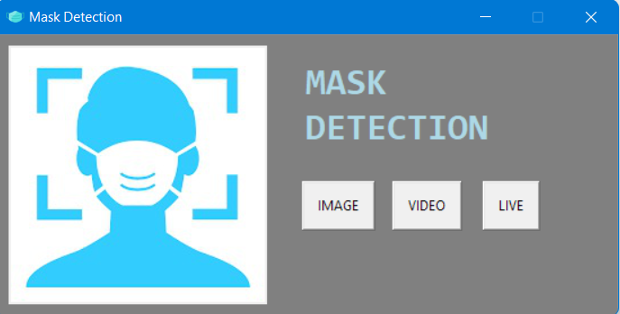
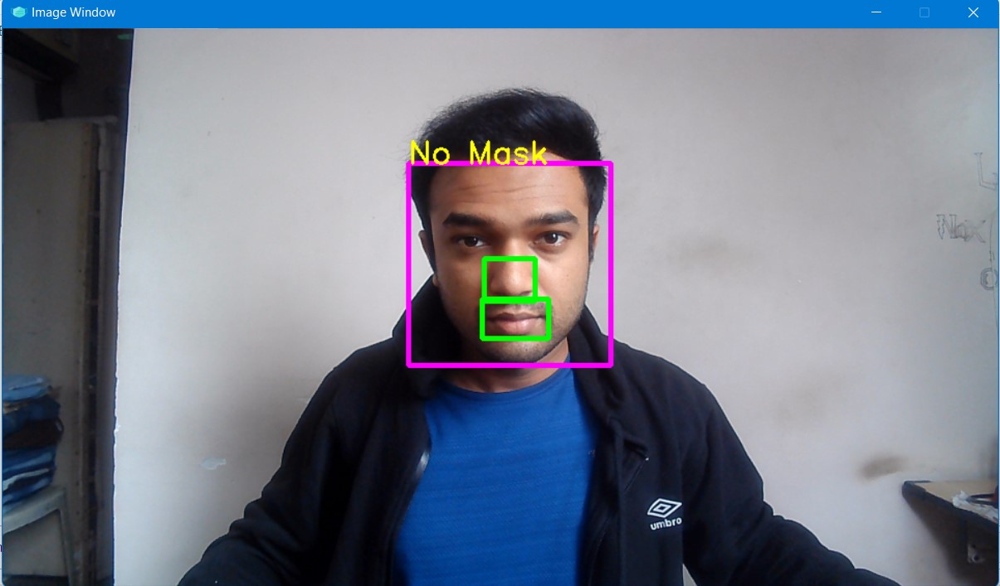
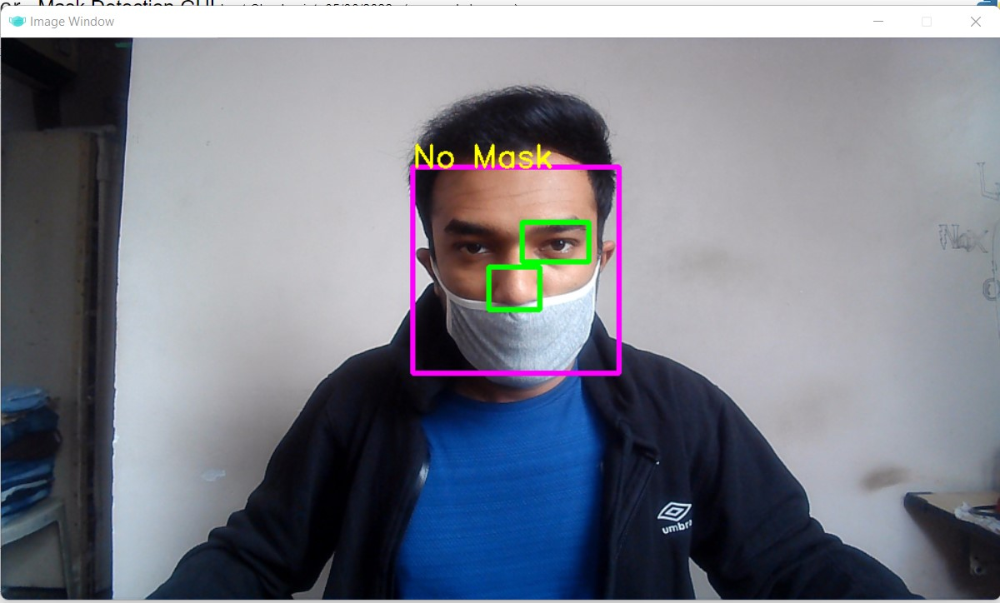
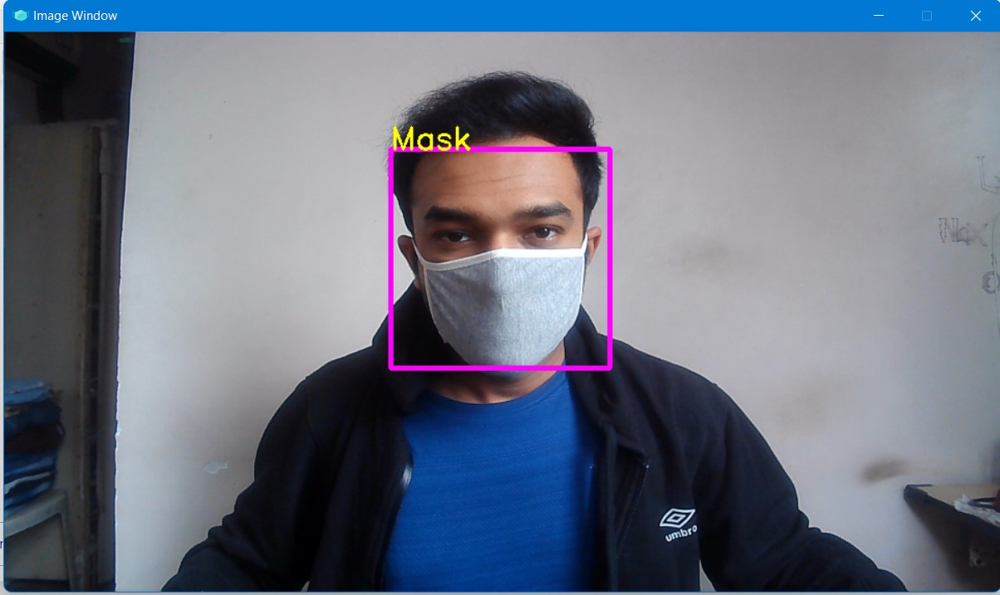
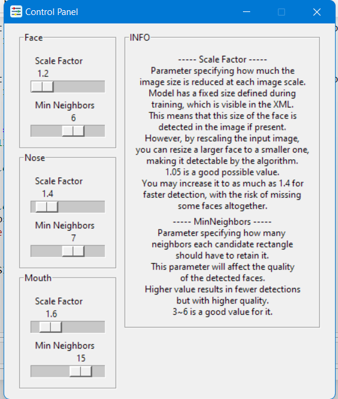

# Mask-Detection-using-machine-Learning
* A Mask Detection program which uses OpenCV and Haar Cascade.
* We can perform mask detection on images, videos and live.

  

* For the calculation and representation it uses OpenCV.
* For the GUI of the program it uses Tkinter.
* To detect face, nose and mouth in a frame it uses Haar Cascade.
* Based on the features identified in a frame it concludes if the person has worn Half Mask, No Mask or Full Mask. The features over here are nose and mouth.

  
  
  

* With the help of the control panel we can change the parameters of the Haar Cascade to detect the face, nose and mouth in a frame.

  

* Before running the program install the following modules:-
  * numpy
  * cv2
  * pillow
  * customtkinter
